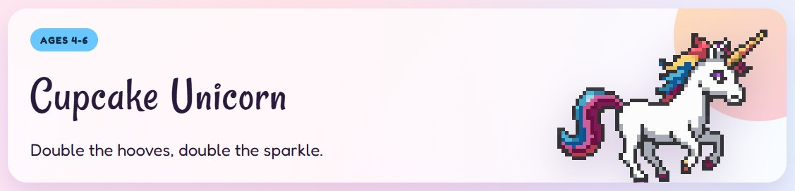
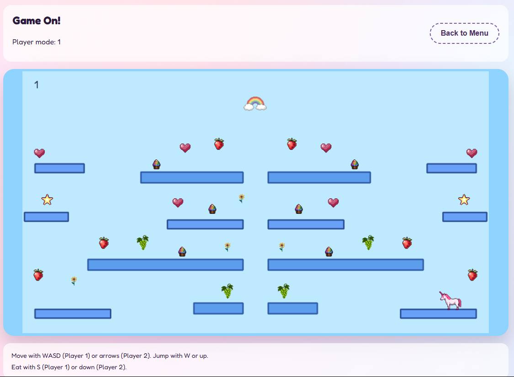

# CupcakeUnicorn

A playful unicorn mini-game built with Vue 3, TypeScript, and Vite.



## Origin

This project was directed by my six year old as part of her birthday celebration. Everything here was AI generated, including the code and assets.

## Open Source

This project is open source and free to use under the MIT license.



## Development

Install dependencies:

```bash
npm install
```

Run the dev server:

```bash
npm run dev
```
